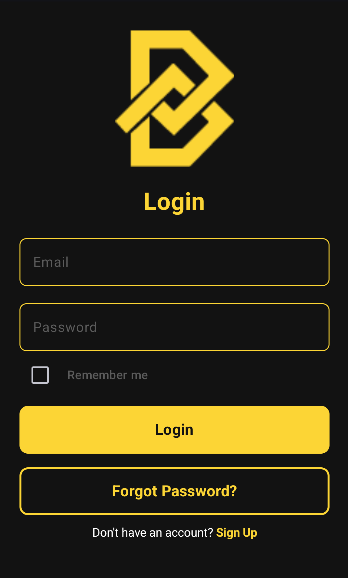
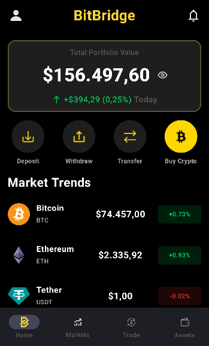
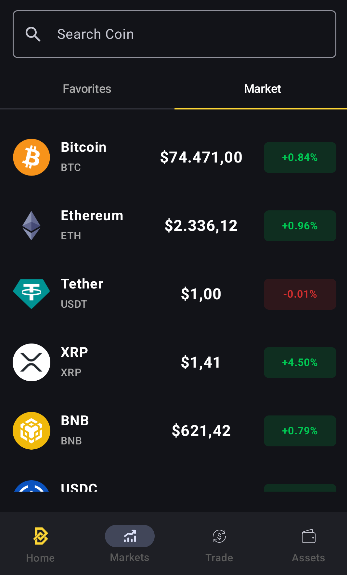
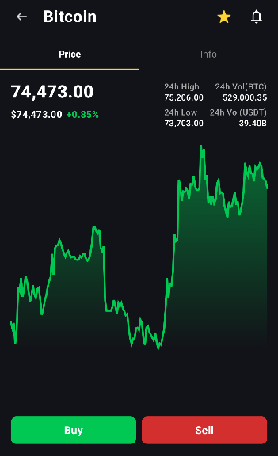
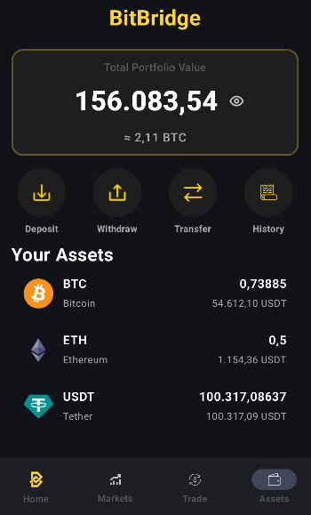

# BitBridge 🚀

**BitBridge** is a modern Android application that allows users to track cryptocurrency data and simulate basic trading operations.

## 📱 Project Purpose
This application is developed to track the cryptocurrency market, provide user authentication, and manage data in a cloud-based system. It also serves as a hands-on project to practice modern Android development approaches. A core feature of BitBridge is its trading simulator, which allows users to practice trading strategies using a virtual balance. By providing a risk-free environment with simulated transactions, users can experience market dynamics without any financial risk. Additionally, this project serves as a hands-on implementation of modern Android development patterns and clean architecture.
## 🛠️ Technologies Used
- Kotlin
- Android Studio
- Jetpack Compose

## 🧩 Architecture & Structures
- MVVM (Model-View-ViewModel)
- Dependency Injection (DI)
- Retrofit – for API operations (CoinGecko Crypto Data API)
- Firebase Authentication – for user authentication
- Firebase Firestore – for data storage

## ⚙️ Features
- User registration & login system
- Real-time data fetching (API)
- Modern and responsive UI (Jetpack Compose)
- Cloud-based data management

## 🎯 Goal
This proje ct aims to provide a scalable mobile application structure using clean architecture, maintainable code practices, and modern Android development tools.

## 📸 Screenshots

  
  
  

  
  

